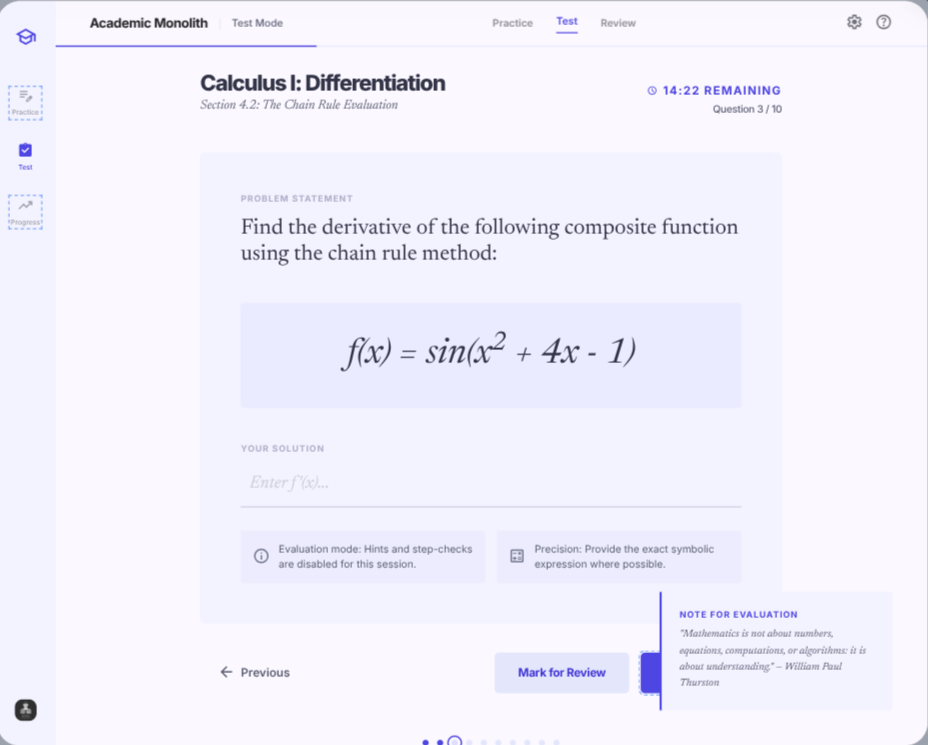
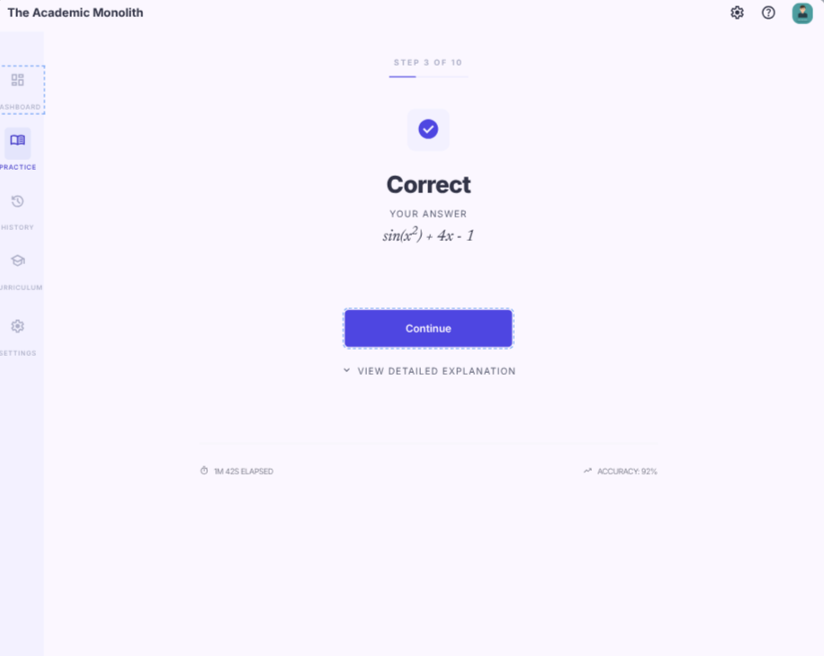
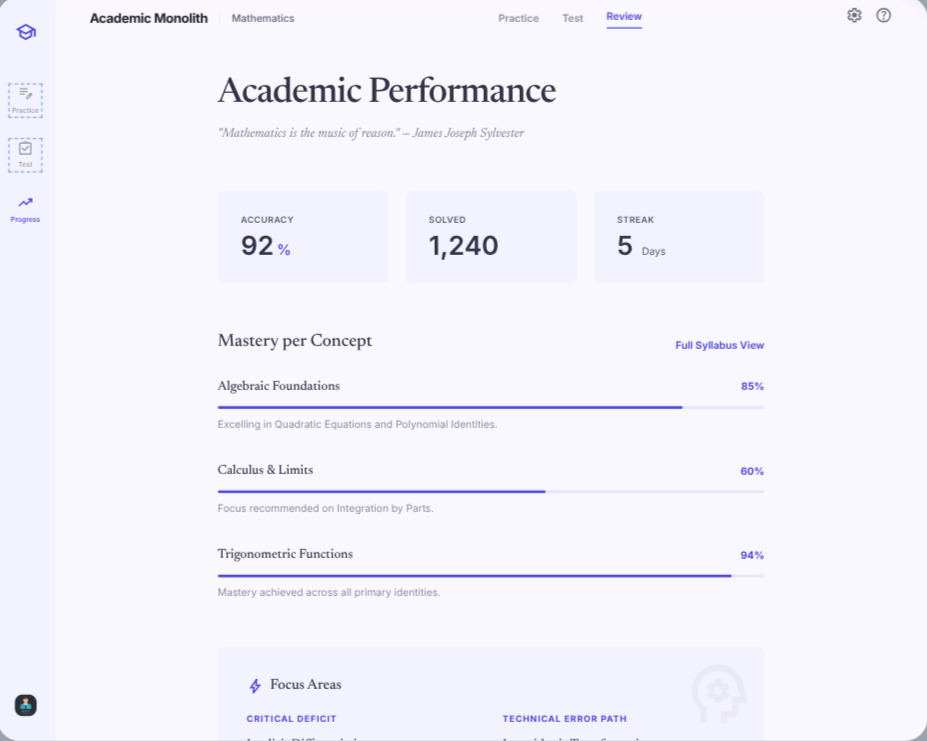

# 🎓 AI Learning Tool: Precision Diagnostics

[](https://www.python.org/)
[](https://flask.palletsprojects.com/)
[](LICENSE)

> **"Don't just explain the content—diagnose the mistake."**

This project is an intelligent learning platform designed to go beyond traditional flashcard apps. While tools like NotebookLM focus on explaining documents, this engine focuses on identifying *why* a student is failing and providing actionable, AI-driven advice to bridge specific conceptual gaps.

---

## 📸 Sneak Peek

### Core Learning Experience
| **Practice Mode** | **Detailed Feedback** |
|:---:|:---:|
|  |  |
| *Intuitive question interface with LaTeX rendering support.* | *Immediate feedback on correctness with step-by-step logic.* |

### Performance Tracking
| **Mistake Analysis** | **Result Breakdown** |
|:---:|:---:|
|  |  |
| *Visual indicators for incorrect answers to highlight weak points.* | *Visualizing progress and mastery across different topics.* |

---

## 🚀 Key Features

- **🎯 Deterministic MCQ Engine**: High-fidelity flashcard and quiz system using static, validated content.
- **🧠 AI Mistake Diagnosis**: Instead of hallucinating content, AI analyzes your mistake patterns to provide surgical advice.
- **📈 Progress Visualization**: Track mastery over time with a dedicated performance dashboard.
- **🧪 LaTeX Integration**: Perfect for STEM subjects, ensuring mathematical formulas are rendered beautifully and accurately.
- **📁 JSON-Based Storage**: Lightweight, portable, and easy-to-manage data structure for flashcards and student history.

---

## 🛠️ Architecture & Evolution

The project follows a modular 3-phase development roadmap:

### Phase 1: Core Engine
- Establishment of the Flask backbone.
- Implementation of the deterministic quiz engine.
- Persistent storage of mistake data (question ID, topic, user vs. correct answer).

### Phase 2: UX Excellence
- Polished UI with smooth transitions.
- Real-time progress bars and mistake highlighting.
- Stable LaTeX rendering for complex equations.

### Phase 3: AI Insights (Current Focus)
- **Topic Grouping**: Mistakes are grouped by concept before being sent to the LLM.
- **Actionable Feedback**: AI identifies "Weak Concepts" and "Reasons for Failure" rather than just providing answers.
- **Safe AI Implementation**: AI is restricted to advisory roles, preventing content hallucinations.

---

## 💻 Tech Stack

- **Backend**: Flask (Python)
- **Frontend**: HTML5, Vanilla CSS, Jinja2 Templates
- **Data**: JSON (Local Persistence)
- **Math Rendering**: LaTeX
- **Intelligence**: LLM-powered Pattern Recognition

---

## ⚙️ Setup & Installation

1. **Clone the repository**:
   ```bash
   git clone <repository-url>
   cd learning-tool
   ```

2. **Install dependencies**:
   ```bash
   pip install flask
   ```

3. **Run the application**:
   ```bash
   python app.py
   ```
   *The app will be available at `http://127.0.0.1:5000`.*

---

## 🎨 Design Philosophy

The interface follows a **Clean & Minimal** aesthetic to reduce cognitive load, allowing students to focus entirely on the material. High-contrast feedback states (Success Green / Error Red) provide immediate psychological reinforcement during the learning process.

---

*Developed for the Academic Monolith Phase 1 Review.*
